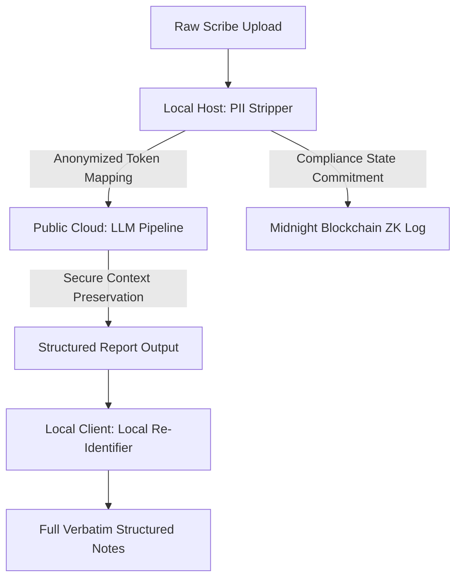

# Aegis: Secure Privacy-First AI Agent Orchestrator

Aegis is a state-of-the-art, enterprise-grade AI agent orchestration platform designed to run powerful LLM workflows while preserving absolute data confidentiality. By combining local-first PII anonymization, dynamic client-side re-identification, and cryptographic logging via the **Midnight Blockchain**, Aegis guarantees strict compliance (HIPAA, GDPR, CCPA) without degrading AI capabilities.

---

## 🚀 Key Features

- **Dynamic AI Agent Generator**: Describe your agent's goal in natural language, and Aegis will automatically generate a fully connected, custom multi-node orchestration pipeline.
- **Local Presidio-Grade PII Stripping**: Identifies and redacts sensitive patient, financial, or personal information (names, emails, dates, vitals) *locally* before any data leaves your server.
- **Verbatim Client-Side Re-Identification**: Re-injects the original patient credentials securely inside your browser, so clinical staff see complete, accurate reports while LLMs remain 100% blind to identities.
- **28 Pre-Integrated Functional Tools**: A rich suite of processors spanning Input Nodes (File Upload, Trigger), Transform Utilities (CSV/JSON/Text Splitting), Advanced AI (LLMs, Summarizers, Sentiment), and local code sandboxing.
- **On-Chain Cryptographic Auditing**: Anchors compliance logs and execution commitments permanently onto the **Midnight Blockchain** using zero-knowledge proofs. Features live testnet explorer linking.
- **Real-Time Telemetry Dashboard**: A high-contrast, premium, neo-noir inspired terminal interface that tracks pipeline executions node-by-node.

---

## 🛠️ Architecture Stack

- **Backend**: FastAPI, SQLModel, SQLite, high-fidelity local entity anonymization engine
- **Frontend**: Next.js 14, React, TypeScript, HSL tailored CSS variables, telemetry micro-animations
- **Blockchain Integration**: Midnight Testnet ZK-proof contract commitments

---

## 📁 Project Structure

```text
├── backend/
│   ├── models/           # SQLModel database schemas (Agent, AgentRun, AuditLog)
│   ├── routers/          # FastAPI API endpoint routers (Agents, Audit, LLM)
│   ├── services/         # Core orchestration engines (Workflow Executor, Privacy, LLM Router)
│   └── tools/            # 28 fully functional pipeline processors (llm_prompt, pii_stripper, etc.)
├── frontend/
│   ├── app/              # Next.js App Router (Dashboard, Agent Canvas, Execution Telemetry)
│   ├── components/       # Premium UI components (Terminal, CanvasEditor, WorkflowBuilder)
│   └── lib/              # Keystore vault and API integrations
├── midnight/             # ZK-proof AuditLog smart contracts (AuditLog.compact)
└── docker-compose.yml    # Single-command container deployment
```

---

## ⚙️ Quick Start

### 1. Prerequisites
- Python 3.10+
- Node.js 18+

### 2. Run the Backend
```bash
# Initialize Python virtual environment
python -m venv venv
venv\Scripts\activate

# Install dependencies
pip install -r backend/requirements.txt

# Start backend server
uvicorn backend.main:app --reload --port 8000
```

### 3. Run the Frontend
```bash
cd frontend
npm install
npm run dev
```
Open [http://localhost:3000](http://localhost:3000) to view the Aegis dashboard!

---

## 🛡️ Privacy & Compliance Architecture



---

## 🔒 Midnight Blockchain Integration

Aegis is integrated directly with the Midnight Network to provide unalterable compliance audits:
1. When a workflow run finishes, the local orchestrator constructs an audit state commitment.
2. The state hash is queued and submitted to the **Midnight Ledger**.
3. Once confirmed, the transaction hash is mapped in your Agent Telemetry panel, providing a verified link to the blockchain explorer.
